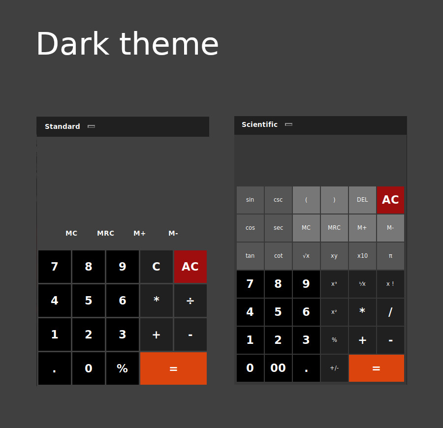

# PyCalc

**version 4.0** 
PyCalc is a modern looking GUI calculator app built in Python using Tkinter library

**What's new** - [Change log](CHANGELOG.md) 
-Scientific calculator 
-color themes
 
 

