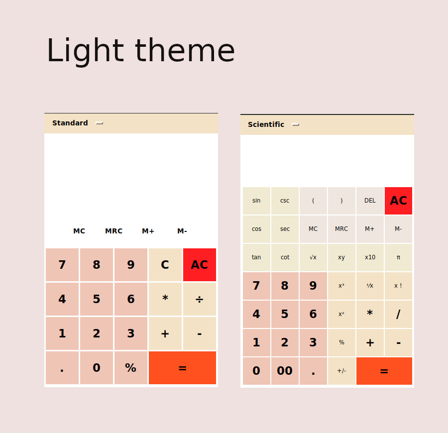

# PyCalc

**version 4.0** - [Change log](CHANGELOG.md) 
PyCalc is a modern looking GUI calculator app built in Python using Tkinter library

**Features** 
-Standard Calculator 
-Scientific Calculator
 
-Color themes
 
-Modern UI
 
-Memory
 
 

